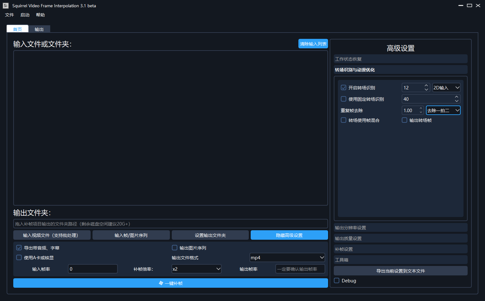

# RIFE GUI 
Aka [Squirrel-Video-Frame-Interpolation](https://github.com/Justin62628/Squirrel-RIFE)

A GUI for RIFE interpolation of long video materials

## SVFI is now available on [STEAM](https://store.steampowered.com/app/1692080/SVFI/)
Built by PyQt5, easy to launch. Support CPU, NVIDIA(CUDA) and AMD([NCNN](https://github.com/Tencent/ncnn) based on [RIFE-NCNN](https://github.com/nihui/rife-ncnn-vulkan))

*Click on the [link](https://store.steampowered.com/app/1692080/SVFI/) for more information*

## Display

## Reference & Acknowledgement
- Video Frame Interpolation Algorithm: [RIFE](https://github.com/hzwer/arXiv2020-RIFE)
- NCNN Support: [RIFE-NCNN](https://github.com/nihui/rife-ncnn-vulkan) 
- SWIG Wraps: [Everything-ncnn-vulkan-python](https://github.com/orgs/media2x/repositories)
- UI Design: [QCandyUi](https://github.com/shuoGG1239/QCandyUi)
- Steamworks Interface: [SteamworksPy](https://github.com/philippj/SteamworksPy)
- Encode Supports: [FFmpeg](https://github.com/FFmpeg/FFmpeg), [QSVEnc](https://github.com/rigaya/QSVEnc), [NVEnc](https://github.com/rigaya/NVEnc), [dovi_tool](https://github.com/quietvoid/dovi_tool), [dlb_mp4base](https://github.com/DolbyLaboratories/dlb_mp4base), [hdr10plus_parser](https://github.com/quietvoid/hdr10plus_parser)
- Super Resolution Algorithm: [waifu2x](https://github.com/nagadomi/waifu2x), [RealSR](https://github.com/jixiaozhong/RealSR), [RealESR](https://github.com/xinntao/Real-ESRGAN)